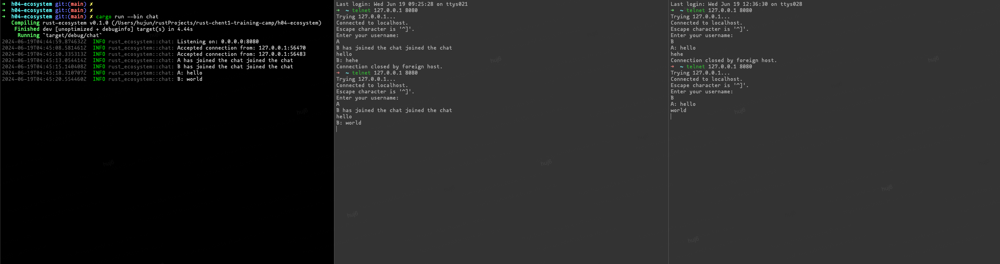

# Rust 生态系统

## 聊天服务

启动服务

```
cargo run --bin chat
```

截图



## URL 短链服务

特色：

- 使用 `thiserror` 处理错误。
- 为自定义错误对象 `ShortenerError` 实现 `axum::response::IntoResponse` trait。
- 插入短链时，如果 id 冲突，将重试 5 次。
- 新增了短链创建时间，和最近访问时间字段。

环境准备

```bash
docker run --name mypostgres -e POSTGRES_PASSWORD=01234567 -p 54322:5432 -d postgres
```

创建数据库

```sql
create database shortener;
```

启动服务

```bash
cargo run --bin shortener
```
